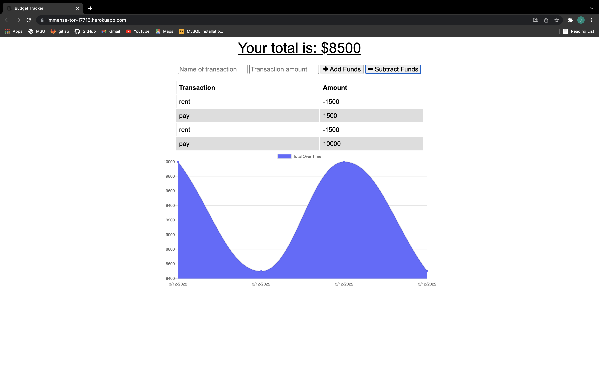

# Budget Tracker
  ## Table of Contents
  * [Project Description](#project-description)
  * [Installation](#installation)
  * [Usage](#usage)
  * [License](#license)
  * [Contributing](#contributing)
  * [Questions?](#questions)
  ## Project Description
  A Budget Tracker application that allows users to add expenses and deposits to their budget with or without a connection. When entering transactions offline, they should populate the total when brought back online.
  ## Installation
  npm install
  ## Usage
  npm start
  ## License
  This project is under MIT for licensing.
  
  ## Contributing
  Feel free to submit code  
  ## Website
  https://immense-tor-17715.herokuapp.com/

  
  ## Questions
  please feel free to ask me any questions.
  Github username: Dylanbitto
  Github Email: <dylanbitto5425@gmail.com>
  